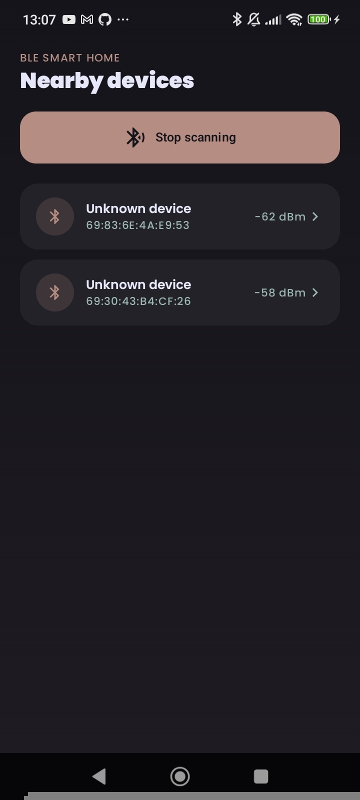
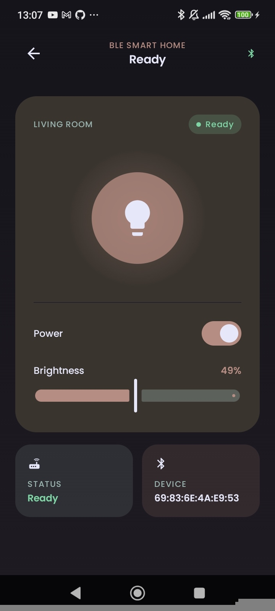
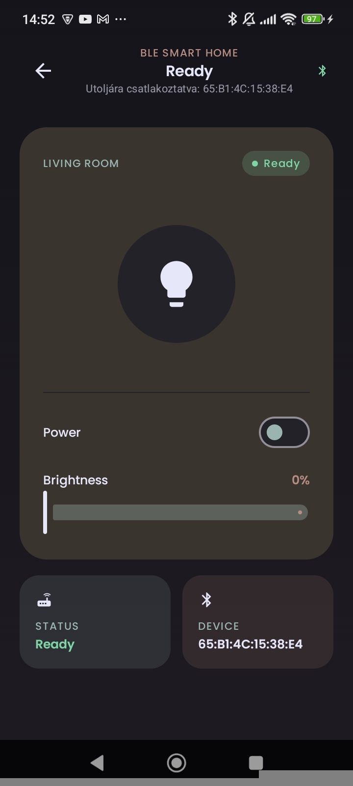

# Smart Home BLE Demo

## Screenshots

| Nearby devices | Smart Home control | Utolsó eszköz kijelzése |
|---|---|---|
|  |  |  |

## What is this?
A small but full-featured Android app (Kotlin + Jetpack Compose + Hilt) that acts as a "BLE hub":
finds nearby Bluetooth Low Energy devices, connects via GATT, discovers a custom
"Smart Home" service, and allows you to toggle a virtual light switch + dimmer slider located
on the peripheral.

## Architecture
- MVVM + Hilt dependency injection (same pattern as in your other apps)
- Android callback-based BLE APIs wrapped in Kotlin `Flow` / `StateFlow`
(`callbackFlow` for scanning, `StateFlow` for connection + feature state), so the UI

never touches `BluetoothGattCallback` directly
- Jetpack navigation Assembly: Scanning screen → Smart home control screen

### File Map
- `ble/BleConstants.kt` — custom service/feature UUIDs
- `ble/BleScanner.kt` — BLE scanning wrapped as `Flow<ScannedDevice>`
- `ble/BleGattManager.kt` — connect, service discovery, read/write/notify, available as `StateFlow`
- `ble/BlePermissions.kt` — runtime permission set (different from Android 12 before/after version)
- `di/BleModule.kt` — Hilt module that provides `BluetoothAdapter`
- `ui/scan/` — device scan screen + ViewModel
- `ui/smarthome/` — light switch / brightness screen + ViewModel

## BLE concepts used
- Central vs. Peripheral roles
- GATT (Generic Attribute Profile): Services → Features → Descriptors
- Custom 128-bit UUIDs vs. standard Bluetooth SIG UUIDs
- Scan filters vs. unfiltered scanning, RSSI
- Read/Write/Notify of characteristic properties
- CCCD (Client Characteristic Configuration Descriptor) — required to actually enable notifications,
not just to call `setCharacteristicNotification()`
- Runtime permissions: `BLUETOOTH_SCAN` / `BLUETOOTH_CONNECT` (Android 12+, with `neverForLocation` flag) vs. `ACCESS_FINE_LOCATION` on older Android
- Connection state machine: Disconnected → Connecting → Connected → Searching for services → Done
- Why BLE requires a real device for central scanning, not an emulator

## How to test without real hardware
Simulate the "peripheral" side with a free app on a second Android phone:

1. Install the "nRF Connect for Mobile" (Nordic Semiconductor) app from the Google Play store on a second phone.

2. Open it → find the "GATT Server" / "Local Server" section → add a new service.

3. Create a service with UUID `5b1d2f00-1a2b-4c3d-9e8f-7a6b5c4d3e2f`.
4. Add two properties inside the service:
- `5b1d2f01-1a2b-4c3d-9e8f-7a6b5c4d3e2f` — properties "Write + Notify" (the light switch,
1 byte: `0x00` = off, `0x01` = on)
- `5b1d2f02-1a2b-4c3d-9e8f-7a6b5c4d3e2f` — properties "Read + Write" (brightness 0-100, 1 byte)
5. Start advertising the GATT server from your phone.

6. On your primary phone, open this app, tap "Search for devices", select the advertising device,
then toggle the switch / drag the slider. nRF Connect shows incoming writes live, and you can send a notification from nRF Connect to see the light bulb icon animation in the app.
   
7. Teszt módosítás egy branch-en.